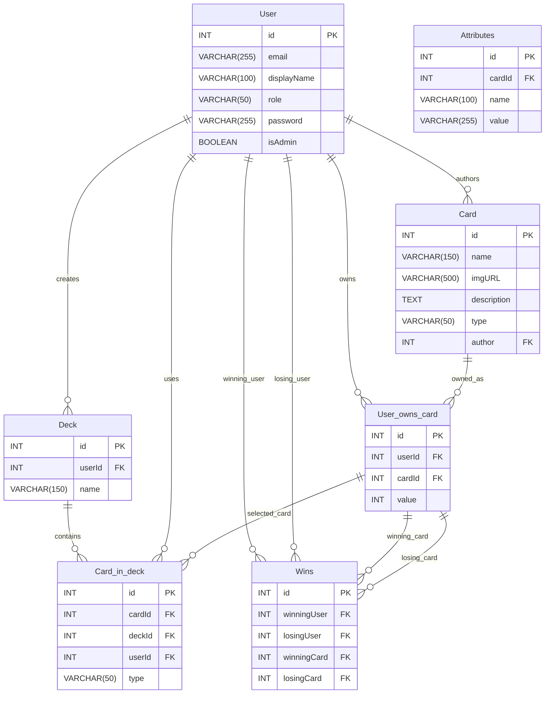

```mermaid
erDiagram
    User {
        INT id PK
        VARCHAR(255) email
        VARCHAR(100) displayName
        VARCHAR(50) role
        VARCHAR(255) password
        BOOLEAN isAdmin
    }

    Card {
        INT id PK
        VARCHAR(150) name
        VARCHAR(500) imgURL
        TEXT description
        VARCHAR(50) type
        INT author FK
    }

    Attributes {
        INT id PK
        INT cardId FK
        VARCHAR(100) name
        VARCHAR(255) value
    }

    User_owns_card {
        INT id PK
        INT userId FK
        INT cardId FK
        INT value
    }

    Deck {
        INT id PK
        INT userId FK
        VARCHAR(150) name
    }

    Card_in_deck {
        INT id PK
        INT cardId FK
        INT deckId FK
        INT userId FK
        VARCHAR(50) type
    }

    Wins {
        INT id PK
        INT winningUser FK
        INT losingUser FK
        INT winningCard FK
        INT losingCard FK
    }

    User ||--o{ Card : authors
    User ||--o{ User_owns_card : owns
    Card ||--o{ User_owns_card : owned_as
    User ||--o{ Deck : creates
    Deck ||--o{ Card_in_deck : contains
    User ||--o{ Card_in_deck : uses
    User_owns_card ||--o{ Card_in_deck : selected_card
    User ||--o{ Wins : winning_user
    User ||--o{ Wins : losing_user
    User_owns_card ||--o{ Wins : winning_card
    User_owns_card ||--o{ Wins : losing_card
```