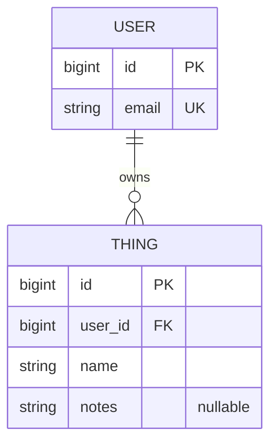

# <API name> Proposal

## 1. The pitch (one paragraph)
What the API does, who uses it, and why a client app would need it.
Our API allows users to create their own user, edit their own user, and delete their own user. Users
can create their own cards, edit their own cards, and delete their own cards. Users can also GET other
cards, either from a specific parameter, all cards, or random card. A client app would need this
API if they plan on using our app to create, trade, and battle cards as their own user.

## 2. Resources
| Resource   | Key fields                            | Relationships                        | 
|------------|---------------------------------------|--------------------------------------|
| User       | id, email, displayName, role, isAdmin | Each user owns 0 to many cards       |
| Card       | id, name, imgURL, description, likes  | Each card belongs to 0 to many users |
| Attributes | id, name, value,                      | Each card has 0 to many attributes   |

## 3. ER sketch
Tables, primary and foreign keys, and cardinality. Edit this Mermaid diagram (it renders on GitHub;
try changes at https://mermaid.live):

## 4. Endpoints
| Verb | Path | Auth | Purpose |
|---|---|---|---|
| GET | /api/v1/workouts?page=0&size=20 | user | list my workouts (paginated) |
| ... | ... | ... | ... |
Mark each endpoint `public`, `user`, or `admin`. Mark which collection paginates and which
filters or sorts.

## 5. Technical choices
- **Database host:** (Neon, Supabase, Railway, Atlas, ...) and why
We are using Railway because of familiarity and easy Postgresql compatibality.
- **OAuth2 provider:** (Google, GitHub, Auth0) and confirmation that it supports Authorization Code + PKCE from a native app
We are going to be using Google for Oauth for simplicity and familiarity
- **Repo layout:** monorepo or split, and why
We are using a monorepo because we think it makes more sense to keep the scope of the project under one repo
These become your ADRs later.

## 6. Risks
The two things most likely to go wrong, and what you will do first to find out.
- We think it is likely for our gradle to have issues because it always does, but especially because we are trying to use the same
gradle for both API and Android builds. We will try to run both skeleton builds with the same gradle on all machines to find out first.
- We think the monorepo might end up causing issues because of the checks and rules being separate for each folder and unfamiliarity with
application of rules per folder instead of per-repo.

## 7. Team and Sprint 1
Who owns what in Sprint 1. Link your Project board and Sprint 1 milestone. (FEEL FREE TO REPEAT ALREADY OWNED THINGS __DELETE WHEN READ)
- What Austin owns:
    - API endroutes and openapi.yaml
- What Michael owns:
    - 
- What Fernando owns:
    - 
- What Gideon owns:
    - 
- [Project Board](https://github.com/users/auPhippsCSUMB/projects/1)
- [Sprint 1](https://github.com/auPhippsCSUMB/CardBattle/milestone/22)

